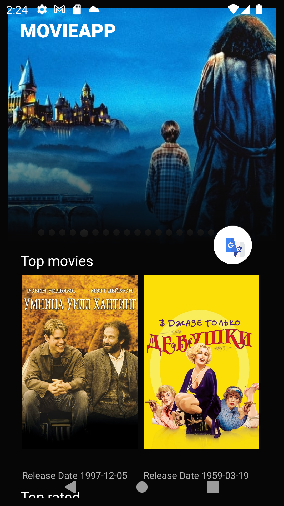
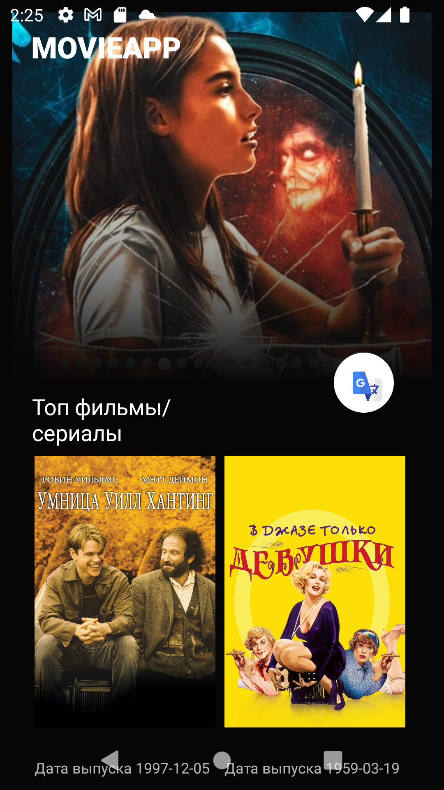
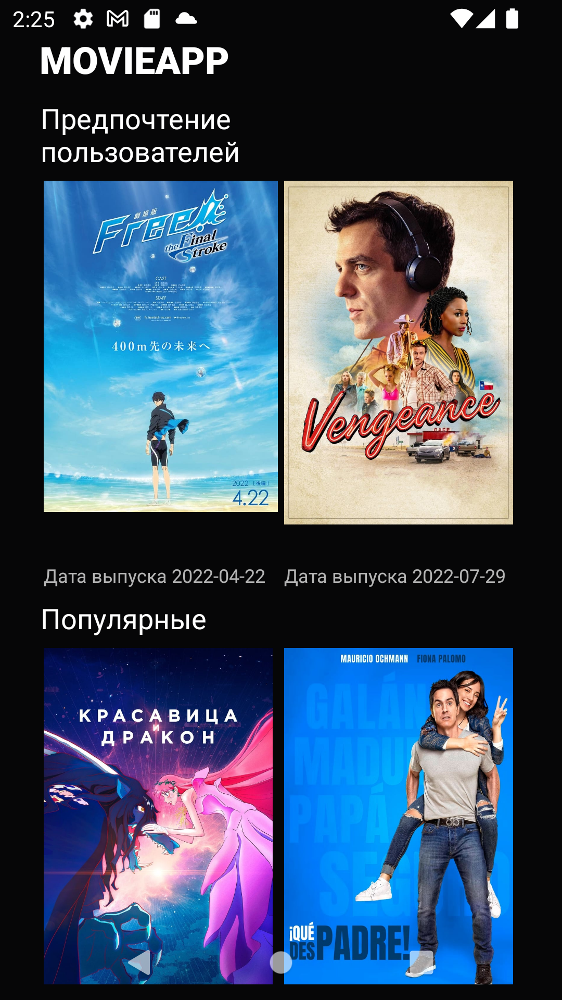

This is the old project from my hard drive. The purpose of this project was to built an app to
discover popular and highly rated movies. It displays three different movie categories, launches a
details screen whenever a particular movie is selected, allows users to read overview, average
rating and poster. This app fetches movie information using themoviedb.org web API.

 

 
